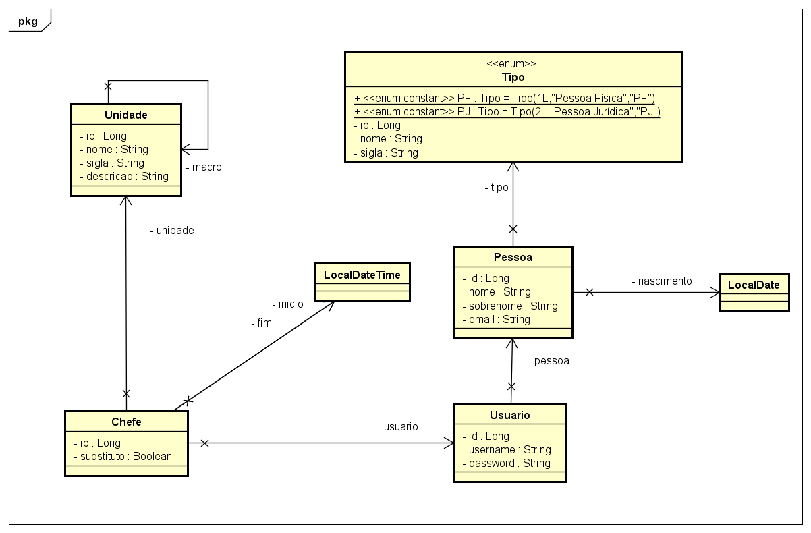
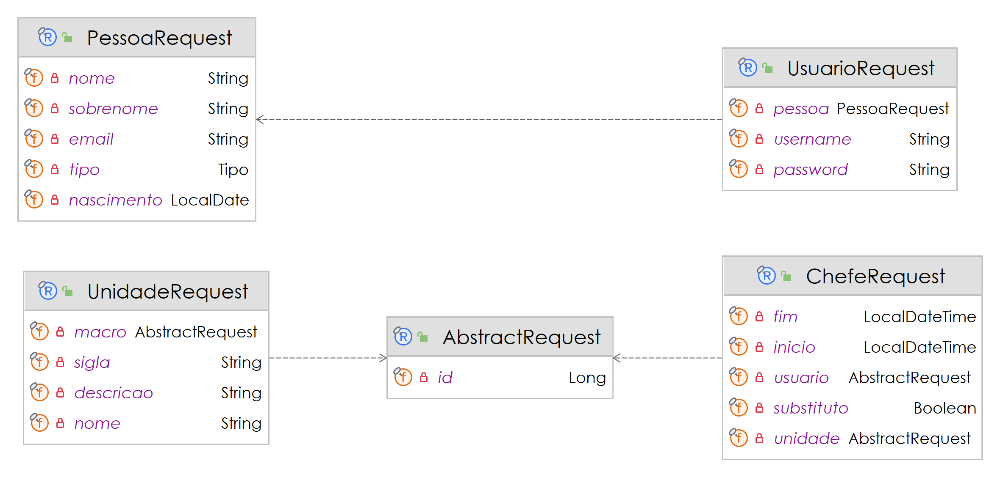
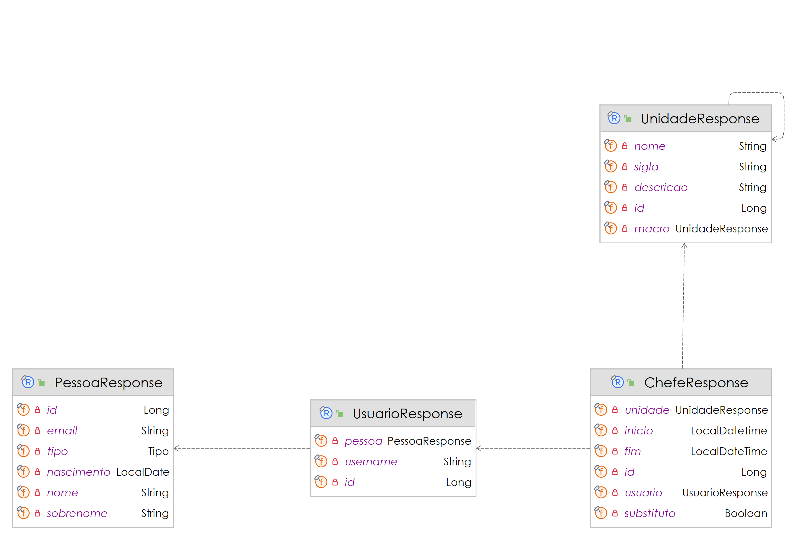

# 🤓👍🏾 Benezinho - Gestão das Unidades da Holding  

SIMULADO PARA CP II - **Java Advanced** aplicado em 22/04/2024.


|                | **Java Advanced** |
|------------------------------------------|-------------------|
| **ALUNO:**                               | **TURMA:** 2TDSPF |
| **PROFESSOR:** Benefrancis do Nascimento | 22/04/2024        |
| **SIMULADO PARA CP II**                  | ****              |

# Sumário


[Estudo de caso ](#_Estudo_de_caso)

[O que deverá ser feito? ](#_O_que_devera_ser_feito)

[Diagrama de Classes ](#_Diagrama_de_Classes)

[Como Entregar ](#_Entrega)

[Correção da Prova ](#_Correcao)

<a id="_Estudo_de_caso"></a>

# Estudo de caso


Administrar empresas de grande porte não é tarefa trivial. Neste sentido, a estruturação organizacional é tarefa fundamental para a gestão das operações empresariais da Holding Benezinho.

O conglomerado empresarial está interessado em reestruturar seus departamentos com o objetivo de melhorar o gerenciamento da segurança, de liberação de acessos aos sistemas e melhor realocação de pessoal.
Este investimento pode oferecer diversas vantagens para o empresário e para os colaboradores, pois com o atual cenário de trabalho remoto, equipes menores e bem gerenciadas podem trazer resultados significativos.

Com o objetivo de fazer este negócio dar certo, idealizamos o desenvolvimento de um Sistema de Gestão de Unidades da empresa.

Criaremos, nesta atividade, um Produto Mínimo Viável (PMV) de uma API Rest para este sistema.

Nossa equipe de analistas desenvolveu o Diagrama de Classes abaixo, e a sua missão aqui é realizar o Mapeamento Objeto Relacional das classes de Entidade. Usaremos a JPA e o Hibernate como ferramentas de Mapeamento Objeto Relacional.

Na sprint atual, você foi incumbido de fazer:

1. O Mapeamento Objeto Relacional das primeiras classes envolvidas neste projeto de software;

2. A criação automatizada das tabelas no banco de dados Oracle;

3. A persistência de todos os dados, e;

4. A criação dos Seguintes Repositorios :

   1. ChefeRepository
   2. PessoaRepository
   3. UnidadeRepository
   4. UsuarioRepository

5. A criação dos Seguintes Resources que devem implementar a ResourceDTO (foi fornecida):

   1. **ChefeResource** com as seguintes ROTAS e VERBOS:
      1. "localhost/chefe" - **GET**, **POST**
      2. "logalhost/chefe/{id}" - **GET**

   2. **UnidadeResource** com as seguintes ROTAS e VERBOS:
      1. "localhost/unidade" - **GET**, **POST**
      2. "logalhost/unidade/{id}" - **GET**
      
   3. **UsuarioResource** com as seguintes ROTAS e VERBOS:
      1. "localhost/usuario" - **GET**, **POST**
      2. "logalhost/usuario/{id}" - **GET**

6. A criação dos Seguintes Services que devem implementar a ServiceDTO (foi fornecida):

   1. **ChefeService** 
   2. **PessoaService**
   3. **UnidadeService**
   4. **UsuarioService** 

7. A criação dos Seguintes DTOs (Objetos de Transferência de Dados) de Request e de Response respeitando os Diagramas de Classe Fornecidos:

   1. **ChefeRequest** e **ChefeResponse**
   2. **PessoaRequest** e **PessoaResponse**
   3. **UnidadeRequest** e **UnidadeResponse**
   4. **UsuarioRequest** e **UsuarioResponse**
   5. **AbstractRequest**


<a id="_O_que_devera_ser_feito"></a>

# O que deverá ser feito?


**Você deverá:**

**Fazer o fork do projeto do github e manter o desenvolvimento versionado no github.**:

[https://github.com/Benefrancis/simulado-spring-pg-unidades](https://github.com/Benefrancis/simulado-spring-pg-unidades)

Caso o github esteja indisponível, você deverá pegar o projeto no diretório compartilhado.

Alterar o arquivo contido em  **documentacao/equipe.txt** para incluir os RMs e nomes e turma da dupla que fará esta atividade. Aproveite para incluir a Data e o Ponto que, por ventura, conquistaram nas aulas.

**OBS:** Será com base nos nomes contidos neste aquivo que eu irei atribuir a nota.

1. **(0,5 Ponto)** Manter o projeto versionado no github, entregando para o professor o arquivo compactado contendo o histórico dos commits realizados pela dupla.

## No pacote entity, Mapear Corretamente as entidades fornecidas, não deixando de incluir corretamente as Unique Constraints com nomes inteligíveis.

2. **(1,5 Ponto)** Adicionar corretamente as anotações JPA na classe **Chefe**. 
Lembrando-se que é necessário fazer a UK para garantir que não se tenha mais de um usuário (chefe), na mesma unidade com a data fim. Ou seja devemos evitar de ter para o mesmo usuário dois registros ativos de chefia para uma unidade.

3. **(1 Ponto)** Adicionar corretamente as anotações JPA na classe **Pessoa**.
Lembrando-se que é necessário fazer a UK para garantir que não se tenha mais de uma pessoa com o mesmo e-mail.

4. **(1 Ponto)** Adicionar corretamente as anotações JPA na classe **Unidade**.
Lembrando-se que é necessário fazer a UK para garantir que não se tenha mais de uma unidade com a mesma SIGLA na mesma unidade macro.

5. **(1 Ponto)** Adicionar corretamente as anotações JPA na classe **Usuário**.
Lembrando-se que é necessário fazer a UK para garantir que não se tenha mais de um usuário para a mesma pessoa e que também não se possa ter mais de um usuário com o mesmo username.


## No pacote resources criar as seguintes classes

A criação dos Seguintes Resources que devem implementar a ResourceDTO (foi fornecida):

1. **(1,5 PONTO)****ChefeResource** com as seguintes ROTAS e VERBOS:
   1. "localhost/chefe" - **GET**, **POST**
   2. "logalhost/chefe/{id}" - **GET**
   
**ATENÇÃO**
Deverá ser possível consultar chefes pelos campos:
      1. usuario.id
      2. substituto
      3. unidade.id


2. **(0,5 PONTOS)** **UnidadeResource** com as seguintes ROTAS e VERBOS:
   1. "localhost/unidade" - **GET**, **POST**
   2. "logalhost/unidade/{id}" - **GET**

**ATENÇÃO**
Deverá ser possível consultar unidades pelos campos:
      1. nome
      2. sigla
      3. macro.id

3. **(2 PONTOS)** - **UsuarioResource** com as seguintes ROTAS e VERBOS:
   1. "localhost/usuario" - **GET**, **POST**
   2. "logalhost/usuario/{id}" - **GET**

**ATENÇÃO**
Deverá ser possível consultar usuarios pelos campos:
      1. username
      2. pessoa.id
      3. pessoa.nome
      4. pessoa.sobrenome
      5. pessoa.nascimento
      6. pessoa.tipo
      7. pessoa.email


4. **(1,5 PONTOS)** - Execução dos Testes com o **POSTMAN**:
A dupla deverá criar e executar os testes no POSTMAN para todos os endpoints da aplicação, exportar os testes e colocar na pasta documentação/requisições.


<a id="_Diagrama_de_Classes"></a>

# Diagrama de Classes de Entidade




# Diagrama de Classes de Request



# Diagrama de Classes de Response




<a id="_Entrega"></a>

# Como Entregar

**A entrega deverá ser feita pelo Teams**, você deverá postar o arquivo compactado do projeto. Porém não se esqueça antes de fazer o **commit** e **push** do projeto no github.

**ATENÇÃO**
Não será aceito para correção o link para o projeto no github. O aluno que entregar apenas o link receberá nota **ZERO**

<a id="_Correcao"></a>

# Correção da Prova

Nos próximos dias, a correção da prova será disponibilizada no github do professor (branch correcao):

Para acessar digite no prompt:

```shell
git clone https://github.com/Benefrancis/simulado-spring-pg-unidades && cd simulado-spring-pg-unidades  && git checkout correcao
```


A avaliação é em dupla.
**Não copie, não forneça e nem aceite o código de outro aluno.**
O professor acessará o log do github e de outras fontes para ver se a avaliação foi fraudada. 
Caso o arquivo compactado não tenha o log igual ao do github, a dupla receberá nota **ZERO**
Em caso de fraude **de qualquer tipo** à atividade avaliativa, todos os envolvidos receberão nota **ZERO**


Boa avaliação.
